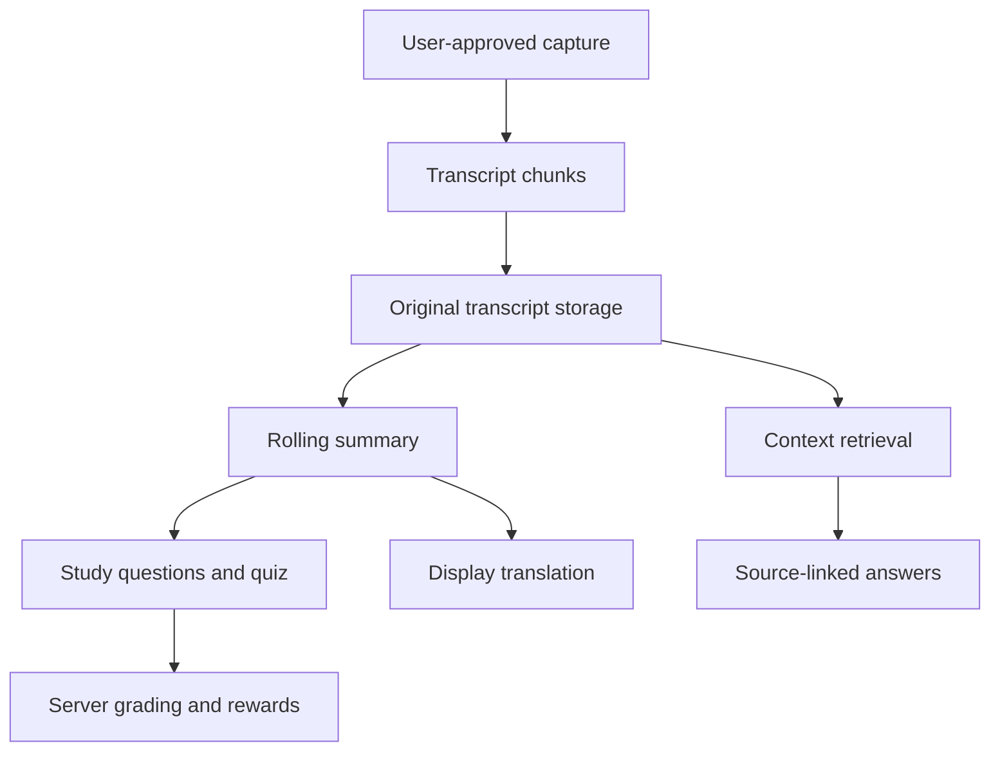

# MeetMind AI

**Real-Time Multilingual AI Meeting Companion & Learning Assistant**

Listen. Understand. Learn.

An original Chrome extension and web dashboard that turns permission-based meeting capture into rolling notes, source-linked answers, study questions, knowledge tests and progress. Built as a runnable full-stack final-year project, with a no-key sample lesson and interchangeable AI providers.

## Start here — Windows

Install **Python 3.11 or 3.12**, **Node.js 22+**, and **Chrome 116+**. Extract this ZIP into a normal folder, for example `C:\Projects\meetmind-ai`.

1. Double-click **`setup.bat`**. It creates a Python virtual environment, installs dependencies, creates local environment files and builds the dashboard and extension.
2. Double-click **`start.bat`**. Keep both terminal windows open.
3. Open **http://127.0.0.1:5173**.
4. Click **Explore the demo**, then **Play sample lesson**. Eight transcript segments arrive gradually.
5. Ask **“What does supervised learning use?”**. Switch the notes between English, Tamil, Malayalam and Hindi.
6. Click **Stop meeting → Take knowledge test**. Finish the quiz and open **Rewards**.

The demo uses a temporary learning account saved in your browser. For an account you can also use in the extension, create an account with your own email/password instead. There is no email delivery or verification step.

**No paid API key or MongoDB installation is needed for the default demo.** Its data is stored persistently in SQLite on your computer. The intended full stack uses the included MongoDB adapter; see below. An internet connection is needed to download dependencies the first time.

## Included features

- React + TypeScript dashboard: landing, registration/login, overview, live workspace, meeting history, meeting details, quiz, results, rewards, Ask AI and settings.
- Original near-black/indigo visual design, responsive navigation, light/dark themes, Lucide icons, subtle Framer Motion intro and reduced-motion support.
- Manifest V3 Chrome side panel, explicit capture controls, page caption extraction, tab audio through an offscreen document, and Chrome storage persistence.
- Optional microphone speech recognition in the dashboard; optional shared-tab audio transcription through faster-whisper.
- Original transcript storage, idempotent chunk uploads, paused/completed state enforcement, WebSocket updates with polling fallback.
- Incremental summaries, meaningful study questions, decisions/action items, and context-based short answers with transcript references.
- English, Tamil, Malayalam and Hindi display languages. Translations start from the original summary. Original transcript text stays unchanged.
- Server-generated tests, server-side grading, exactly **50% or higher = pass**, encouragement below 50%, badges and repeat-safe XP.
- Search/filter history, JSON export, transcript deletion with derived-content cleanup, meeting deletion and clear history.
- JWT login, Argon2 password hashing, per-user ownership checks, input validation, bounded transcripts and basic request throttling.

## What works without an AI key?

| Feature | Demo provider | Configured AI provider |
| --- | --- | --- |
| Sample Machine Learning lesson | Eight timed, prepared segments | Available |
| Sample summaries, questions and translations | Curated English/Tamil/Malayalam/Hindi content | Generated by selected provider |
| Custom transcript summaries | Clearly described extractive notes | Incremental AI summaries |
| Custom study questions | Basic fill-in-the-blank short answers | MCQ, true/false and short answer |
| Context Q&A | Lexical retrieval + verbatim extracts | Retrieval + grounded AI answer |
| Translate arbitrary meetings | Returns an explanatory error; does not fake translation | AI translation |
| Transcribe real audio | Requires optional faster-whisper or browser speech recognition | Same speech options; LLM key alone does not enable STT |

The sample is **not live meeting audio**, and demo extractive processing is **not a generative model**. Its purpose is to make the end-to-end workflow usable and inspectable without external credentials.

## Manual installation

From the project root:

```bash
npm install
```

Backend, in a separate terminal:

```bash
cd backend
python -m venv .venv
```

Activate on Windows PowerShell:

```powershell
.\.venv\Scripts\Activate.ps1
```

If PowerShell blocks activation, use the interpreter directly: `.\.venv\Scripts\python.exe -m pip install -r requirements.txt`, then `.\.venv\Scripts\python.exe -m uvicorn app.main:app --host 127.0.0.1 --port 8000`.

On macOS/Linux:

```bash
source .venv/bin/activate
```

Then:

```bash
python -m pip install -r requirements.txt
```

Copy `backend/.env.example` to `backend/.env`. The defaults select the demo provider and persistent SQLite storage. You can leave `JWT_SECRET` at its example placeholder **only in development**: the server then creates a private random signing key in `backend/data/.jwt-secret` and reuses it across restarts.

```bash
python -m uvicorn app.main:app --host 127.0.0.1 --port 8000
```

Frontend, from the project root in another terminal:

```bash
npm run dev
```

Dashboard: **http://127.0.0.1:5173**. API docs: **http://127.0.0.1:8000/docs**. Health: **http://127.0.0.1:8000/health**.

Copy `frontend/.env.example` to `frontend/.env` to change `VITE_API_URL`. The default is `http://localhost:8000`. Restart Vite after changing it. The default CORS settings permit both localhost and 127.0.0.1 at port 5173.

## MongoDB

To use an existing MongoDB instance, change `backend/.env`:

```dotenv
DB_BACKEND=mongodb
MONGODB_URI=mongodb://localhost:27017
MONGODB_DATABASE=meetmind
```

Or install Docker Desktop, copy `backend/.env.example` to `backend/.env`, and run from the project root:

```bash
docker compose up --build
```

Then run `npm run dev` in another terminal. The Compose file starts MongoDB and the backend, persists both data volumes, keeps MongoDB off host ports, and exposes the API only on localhost. To enable speech in Docker, extend the image to install `requirements-speech.txt`; the base image intentionally contains only the core backend.

Collections: **users, meetings, quizzes, attempts**. In this MVP, transcripts, summary, topics, generated study questions and translation caches are embedded in each meeting; progress and badges are derived from attempts. This avoids inconsistent separate records during deletion. Embedded transcripts are capped at 5,000 chunks or 500,000 characters. For large-scale use, split chunks into their own indexed collection and add a job queue.

## Choose your AI provider

Edit `backend/.env`, then restart the backend. Credentials are never sent to the dashboard or bundled into the extension.

### OpenAI

```dotenv
AI_PROVIDER=openai
AI_API_KEY=your-key
AI_MODEL=gpt-4o-mini
```

Uses the Chat Completions JSON response contract. Set `AI_MODEL` to a model your account supports; model availability and pricing can change.

### Gemini

```dotenv
AI_PROVIDER=gemini
AI_API_KEY=your-key
AI_MODEL=gemini-2.5-flash
```

Uses the `generateContent` REST API with JSON output. Set a model enabled for your account.

### Ollama

Install Ollama separately and pull a suitable model:

```bash
ollama pull llama3.2
```

```dotenv
AI_PROVIDER=ollama
AI_MODEL=llama3.2
OLLAMA_URL=http://localhost:11434
```

Small local models can struggle with structured output or Malayalam/Tamil. Use a model that performs well for the languages you need. For Docker Desktop, an Ollama server on the host is normally reached via `http://host.docker.internal:11434` after configuring Ollama to accept that connection.

### Backend environment reference

| Variable | Default / purpose |
| --- | --- |
| `AI_PROVIDER` | `demo`, `openai`, `gemini`, `ollama` |
| `AI_MODEL` | Provider-specific model; configurable |
| `AI_API_KEY` | Required for cloud AI providers |
| `OLLAMA_URL` | Local Ollama URL |
| `DB_BACKEND` | `sqlite` for zero-setup demo, `mongodb` for MongoDB |
| `SQLITE_PATH` | `data/meetmind.sqlite3` |
| `MONGODB_URI` | Connection URI; server-side only |
| `MONGODB_DATABASE` | `meetmind` |
| `JWT_SECRET` | Random 32+ characters outside development |
| `GOOGLE_CLIENT_ID` | Google Web OAuth client ID for backend token verification |
| `ENVIRONMENT` | `development`; any other value requires explicit secret |
| `CORS_ORIGINS` | Comma-separated allowed dashboard origins |
| `STT_PROVIDER` | `disabled` or `faster-whisper` |
| `WHISPER_MODEL` | `base` by default |

### Google sign-in

Google sign-in is optional. Create a Google OAuth **Web application** client, add your dashboard origin (for example `http://127.0.0.1:5173`) as an authorized JavaScript origin, then set the same client ID in both files before restarting the servers:

```dotenv
# backend/.env
GOOGLE_CLIENT_ID=your-client-id.apps.googleusercontent.com

# frontend/.env
VITE_GOOGLE_CLIENT_ID=your-client-id.apps.googleusercontent.com
```

Install the backend requirements after enabling this feature. Google accounts are verified server-side and receive the same MeetMind session as email accounts.

## Live capture and transcription

### Option A — page captions, through Chrome extension

1. Build from the project root: `npm run build`. The ZIP also includes a prebuilt `extension/dist`.
2. Open `chrome://extensions` in Chrome.
3. Enable **Developer mode → Load unpacked** and select **`extension/dist`**, not `extension/src` or the project root.
4. Pin MeetMind and click its toolbar icon to open the side panel.
5. Sign in using your dashboard account. Configure the local backend URL if needed.
6. Open your meeting in the active browser tab, enable its captions, confirm permission and start an assistant session.
7. Choose **Page captions → Start capture**.
8. If captions do not arrive, see the limitations below or supply the caption text element's CSS selector under **Connection & capture settings**.

There are built-in best-effort selectors for YouTube, Google Meet, Teams and Zoom Web. These services change their DOM, may render captions differently by version/language, and some meetings do not expose captions at all. These adapters need live verification on the actual platform; this project does **not** guarantee universal capture. No content script runs across all sites by default: it is injected only into the active tab after your click.

Captions are debounced and deduplicated. Failed caption submissions remain in a bounded local retry buffer (up to 100 chunks); resume the meeting and retry them before stopping. Partially changing captions can still overlap. No reliable diarization is implemented: a generic speaker label is used unless you provide one through the API.

### Option B — server transcription with faster-whisper

Inside your backend virtual environment:

```bash
python -m pip install -r requirements-speech.txt
```

Change:

```dotenv
STT_PROVIDER=faster-whisper
WHISPER_MODEL=base
```

Restart the backend. The first request downloads the Whisper model and can take time. `base` is practical for an initial CPU test; larger models improve some language accuracy but need more memory/time.

- Dashboard: **Live meeting → Tab audio**, select a browser tab, and enable **Share tab audio**.
- Extension: choose **Tab audio → Start capture** while the meeting tab is active.
- Audio is recorded in independently decodable ~8-second WebM segments, sent to FastAPI, transcribed, then submitted to the same transcript endpoint.
- The browser speech microphone option is separate. Tab capture generally contains remote tab playback, not your own microphone. If both sides of a conversation are required, add an explicit audio-mixing pipeline; this MVP does not claim to record both sides automatically.
- The extension's offscreen document preserves audible tab playback. Capture is explicitly stopped by the user, source-tab closure, or when the side panel detects the meeting has ended/paused.
- Temporary server audio files are removed after transcription, including on errors. No long-term raw audio recording is stored.
- Whisper detects the segment language automatically. Unsupported detected language codes fall back to the selected supported language. The UI's meeting language follows its first chunk; mixed-language sessions retain each chunk's own language.

### Option C — browser microphone

Dashboard **Microphone** and question-field microphone buttons use `SpeechRecognition`/`webkitSpeechRecognition` when available. This captures the microphone only. Browser support, permissions, network behavior and recognition languages vary. The browser vendor may perform recognition remotely. A typed/pasted transcript path always remains available.

## Processing architecture



The first chunk and subsequent two-chunk windows trigger background summarization. **Stop meeting** flushes all remaining chunks. Summarization sends only new chunks plus the bounded previous summary, in batches of up to 12 chunks. It does not repeatedly send the complete meeting. Provider failures leave the original transcript saved; use **Retry processing / Refresh notes**, then generate the quiz.

Context retrieval is **lightweight Unicode-aware lexical retrieval**, not a vector embedding model. The sample additionally indexes the four prepared language versions. Arbitrary multilingual semantic retrieval is more limited; real AI Q&A uses top lexical matches or the six most recent chunks plus summary context. Answers must return valid source IDs. If the model cannot support an answer, the API returns a “not discussed” response. Citations reduce but cannot eliminate hallucination; verify critical information.

Real-time updates use an authenticated WebSocket. Tokens go in the first frame, not URLs; ownership is checked before subscribing. The dashboard also polls as a fallback. The extension polls its active meeting.

**Single backend process is required for this MVP.** Locks, rate limiting and WebSocket subscribers are in-process. Do not start multiple workers until moving these to shared infrastructure.

## Multilingual workflow

Original speech/captions → original transcript → canonical summary/questions → selected display language.

Translations are cached per language and summary revision. Switching English → Tamil → Malayalam always starts from canonical content; it never translates a prior translation. Original transcript is intentionally shown unchanged. Summary, key points, study questions, quiz and Q&A support the display language. Navigation labels remain English. An explicit answer-language override can be made through the language selector.

The curated demo translations cover the supplied lesson only. They are suitable for a project demonstration, and should be reviewed by fluent speakers before publication. AI translation quality depends on the chosen provider/model.

## Quizzes, scoring and rewards

- Approximately 5–15 questions when enough source-supported material exists; short meetings produce fewer questions rather than invented filler.
- Multiple choice, true/false and short answer. Every question has transcript IDs.
- Public test responses omit answers and correct option indices. Study questions deliberately reveal answers separately for revision; this is a learning app, not a secure examination platform.
- Short answers use case-folding, Unicode normalization and punctuation stripping, then exact matching to the stored original/display answer. Semantic synonyms are not accepted automatically.
- Every question must be answered. The server computes score and pass status.
- Time taken is client-reported; it is a learning metric, not tamper-proof exam timing.

| Score | XP entitlement | Badge |
| --- | ---: | --- |
| Below 50% | 0 | Encouragement + review |
| 50–59% | 50 | Starter |
| 60–69% | 75 | Quick Learner |
| 70–79% | 100 | Knowledge Builder |
| 80–89% | 150 | Smart Learner |
| 90–100% | 200 | Meeting Master |

A retake earns only the increase over that quiz's best previous XP entitlement. Repeated perfect scores cannot farm XP. Level = `floor(totalXP/500)+1`. Streaks count consecutive UTC dates with completed attempts; an active streak may end today or yesterday. Average score includes all attempts. Deleting a meeting removes its attempts and associated XP.

## API

The complete interactive schema is available at `/docs`.

| Area | Routes |
| --- | --- |
| Authentication | `POST /auth/register`, `POST /auth/login`, `GET /users/me` |
| Meetings | `POST/GET /meetings`, `GET/DELETE /meetings/{id}` |
| Capture | `POST /meetings/{id}/transcript`, `POST /meetings/{id}/audio`, `PATCH /meetings/{id}/status` |
| Processing | `POST /meetings/{id}/process`, `POST /meetings/{id}/stop` |
| Intelligence | `GET /meetings/{id}/summary`, `GET /meetings/{id}/questions`, `POST /meetings/{id}/ask`, `POST /meetings/{id}/translate` |
| Tests | `POST /meetings/{id}/quiz/generate`, `GET /meetings/{id}/quiz`, `POST /quiz/{quizId}/submit` |
| Progress | `GET /users/me/rewards`, `GET /dashboard` |
| Privacy | `DELETE /meetings/{id}/transcript`, `DELETE /users/me/history`, `GET /meetings/{id}/export` |
| Live | `WS /ws/meetings/{id}` |
| Demo | `GET /demo/lesson?language=en` |

## Project structure

```text
meetmind-ai/
  frontend/             React dashboard + production build
    src/components/     Shared UI and grounded chat
    src/pages/          Product screens
    src/hooks/          Live meeting sync and capture
    src/services/       API client
  extension/            Manifest V3 side panel + prebuilt dist/
    src/panel.tsx       Extension UI
    src/background.ts  Explicit capture lifecycle, caption retry queue
    src/content.ts     Caption adapters
    src/offscreen.ts   Tab audio segments
  backend/
    app/main.py         FastAPI routes and processing coordination
    app/auth.py         JWT and password hashing
    app/models.py       Validated request/AI schemas
    app/ai/             Demo/OpenAI/Gemini/Ollama adapters
    app/database/       SQLite and MongoDB document storage
    app/services/       Summarization and retrieval
    app/speech/         Speech provider abstraction
    app/translation/    Original-source translation cache
    tests/              Behavioral integration checks
  shared/               Shared TypeScript contracts and multilingual sample
  docs/                 Architecture, validation report, screenshots
  scripts/              Browser smoke checks and startup helper
  setup.bat             Windows install/build
  start.bat             Windows start
  docker-compose.yml    MongoDB + API
```

## Development and checks

```bash
npm run typecheck
npm run build
```

```bash
cd backend
python -m pytest -q
```

Core tests cover the full sample flow, four languages, original preservation, unknown-topic abstention, quiz answer stripping, reward thresholds, retake entitlement, exact 50% pass, idempotent ingestion, consent, pause/stop, ownership, authenticated sockets, source validation, export and deletion cleanup.

Optional browser checks (start both servers first):

```bash
npx playwright install chromium
npm run test:ui
```

See **`docs/VALIDATION.md`** for exact checks performed and unverified external integrations. Screenshots in `docs/screenshots/` were captured from this project; no real meeting data is included.

## Privacy and deployment boundaries

- Use only with participant permission and in accordance with platform rules. No automatic microphone or tab audio start.
- Cloud AI receives the relevant transcript/summary for requested processing. Local Ollama and faster-whisper avoid sending those operations to a cloud AI provider, but browser speech recognition may still use vendor services.
- JWTs expire after 12 hours. Logout clears the local token but does not revoke an already copied token. This MVP has no refresh tokens, password reset, account deletion flow, admin roles or organization sharing.
- Tokens are in browser localStorage/extension storage. Harden a public deployment with secure session cookies or an equivalent hardened token design, HTTPS, account controls, request/body limits at the reverse proxy, shared rate limiting, retention policies and observability.
- Authentication and grading are server-side. Frontend input cannot award itself XP.
- Caption parsing and AI outputs are untrusted data. React renders content as text; no provider HTML is executed.
- Keep `.env`, `backend/data`, raw captures and databases out of Git. Do not use the development signing-key behavior on a public deployment.
- Extension capture may continue when the side panel is closed until explicitly stopped or the source tab closes. Chrome's capture indicator remains visible for audio; reopen MeetMind to stop. If a meeting is paused/stopped from another client while the side panel is closed, the server rejects later chunks, but the offscreen capture should be explicitly stopped in Chrome.

## Known limits and future work

This is a full-stack **MVP**, not a universal meeting bot or a production SaaS service. Live third-party meeting DOMs, cloud keys, actual microphone/tab permissions and speech model performance must be checked on your machine. Caption deltas can overlap and speaker identity is not inferred. Audio chunks are serialized for transcription; sustained CPU overload/network loss may create delays or lose segments, with errors shown. Long meetings need background jobs and chunk collections. No calendar integration, PDF/PPT ingestion, PDF export, sharing, flashcards or team workspace is included; these are intentional future extensions.

## Technical references

- [Chrome Side Panel API](https://developer.chrome.com/docs/extensions/reference/api/sidePanel)
- [Chrome audio recording and screen capture](https://developer.chrome.com/docs/extensions/how-to/web-platform/screen-capture)
- [FastAPI WebSockets](https://fastapi.tiangolo.com/advanced/websockets/)
- [Gemini structured outputs](https://ai.google.dev/gemini-api/docs/structured-output)

The source reference chat could not be opened in this environment. The UI was created from the supplied written brief and uses its own identity; it does not copy Sider branding or source code.
